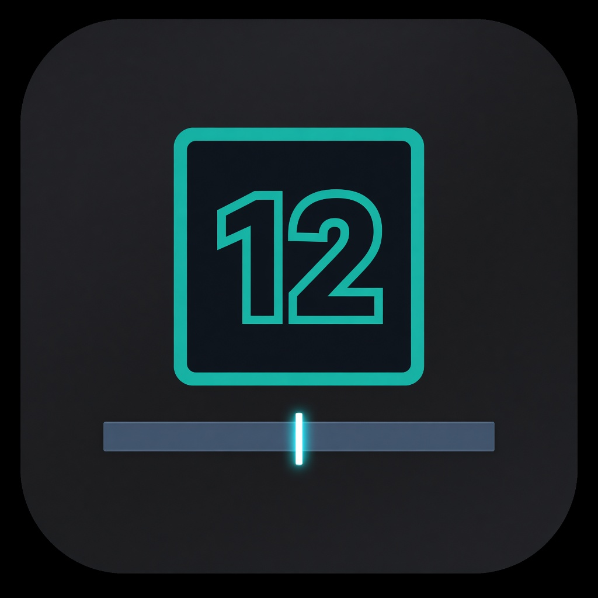

# MissingPowerForever

  

Cast counts on your action buttons for [WoW Forever](https://worldofforever.com/), plus a pulse when regen is about to make a spell affordable, and an optional spark on **your portrait mana bar** after you spend mana.

Inspired by [MissingPower](https://www.curseforge.com/wow/addons/missingpower) by D4KiR. This is a new Forever-safe implementation (secret `UnitPower` values, continuous regen), not a copy of that addon.

## Install

Prefer the [release zip](https://github.com/gitBellucci/MissingPowerForever/releases/latest) (`MissingPower.zip`). Do **not** use GitHub’s green **Code → Download ZIP** unless you rename the folder.

1. Extract so the folder is named exactly **`MissingPower`** (not `MissingPower-main` or `MissingPowerForever-main`)
2. Put that folder in `World of Warcraft\_classic_beta_\Interface\AddOns\`
3. Restart WoW (a `/reload` is not enough the first time)
4. Enable **MissingPowerForever** in the addon list

If it does not appear: the folder name must match the `.toc` file. Rename `MissingPower-main` → `MissingPower`.

Do not install D4KiR’s original MissingPower next to this one — both use the `MissingPower` folder.

## Use

- `/mp` — options (Designer tab: style presets, drag/resize the count, font color and border)
- `/mp toggle` — enable or disable
- `/mp help` — command list

**Cast count** is the number on each spell. **Pulse** flashes a spell when regen is about to make it affordable. **Mana spark** is the tick that slides across your portrait mana bar for 5 seconds after you spend mana.

Works on default bars, Bartender, Dominos, and ElvUI.

## Game versions

Classic Forever (`Interface` 16001 / 11601)

## License

MIT
